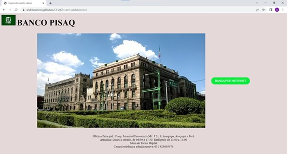
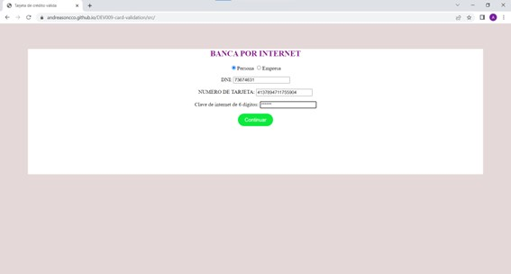
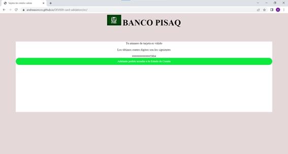
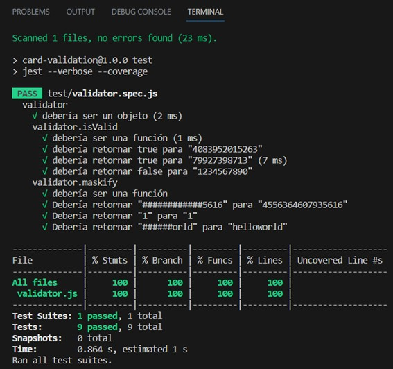
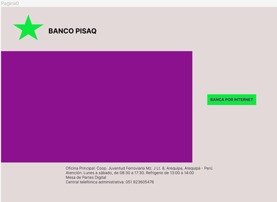
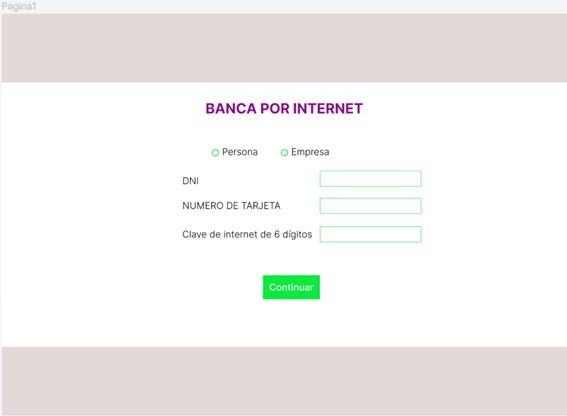
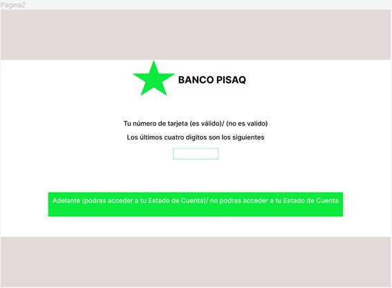

# CARD VALIDATION 💳✔️ - página web del Banco PISAQ 💸🏛

## Índice

* [1. Definición del Proyecto](#1-definición-del-proyecto)
* [2. Proceso de Diseño y Desarrollo](#2-proceso-de-diseño-y-desarrollo)
* [3. Investigación UX](#3-investigación-ux)
* [4. Diseño UI](#4-diseño-ui)
* [5. Herramientas de Elaboración](#5-herramientas-de-elaboración)

***

## 1. DEFINICIÓN DEL PROYECTO
💻
El Presente Proyecto de Card Validation es sobre la interfaz de un Banco donde podemos direccionarnos a Banca Por Internet para conocer nuestro Estado de Cuenta, aquí se aplica la validación de una tarjeta de per persona natural o empresa para permitirles ver su Estado de Cuenta. Asimismo, se debe mostrar los últimos 4 dígitos de la tarjeta en la página. 

La presentación de la página web se muestra a continuación:

**Página Principal 💎**



**Página Secundaria ♣️**



**Última Página ♜**

 

## 2. PROCESO DE DISEÑO Y DESARROLLO

### 2.1. Planificación 📋⌚️
Para realizar la Página Web me organice por sprints utilizando la métodología SCRUM de desarrollo ágil con la herramienta de Trello.

### 2.2. Desarrollo del Producto 😀🛠

Para entender este trabajo empezaremos por explicar la estructura de la página Web, la cual cuenta con tres ventanas y se hizo con HTML, consta del siguiente cuerpo:

#### A.	Página Principal: 
Donde se encuentra el Encabezado con el Nombre de la Empresa: BANCO PISAQ y su logo correspondiente, el botón de acceso a Banca por Internet y debajo en el pie de página nos encontramos con la información de referencia sobre la Empresa para contactarnos con ellos y conocer su horario de atención. Asimismo, la página principal contiene una imagen del Banco que ilustre mejor su visión y los servicios que ofrece.

#### B.	Segunda Página: 
Abarca el acceso a Banca por Internet donde se encuentra la plantilla de los datos que llenar para acceder al Estado de Cuenta.

#### C.	Última Página: 
Nos brinda información sobre si la tarjeta es valida y nos resalta los cuatro últimos dígitos de la tarjeta. Por último, nos indica si se nos permitirá ver nuestro Estado de Cuenta posteriormente.

Seguidamente, luego de implementar la estructura en el HTML se trabajo con JAVASCRIPT para incorporar las dos funcionalidades necesarias:

### I. Funcionalidad para validar tarjeta 💡✅
Para validar la tarjeta aplicamos el Algoritmo de Luhn, también llamado algoritmo de módulo 10, es un método de suma de verificación, se utiliza para validar números de identificación. Este algoritmo es simple y sigue los siguientes pasos:

*	Obtenemos la reversa del número a verificar (que solamente contiene dígitos ```[0-9]```); 
*	A todos los números que ocupan una posición par se les debe multiplicar por dos, si este número es mayor o igual a 10, debemos sumar los dígitos del resultado; el número a verificar será válido si la suma de sus dígitos finales es un múltiplo de 10.

### II. Funcionalidad para mostrar solo los últimos 4 dígitos 💳
Para solo mostrar los últimos 4 dígitos también se usaron las posiciones (i) y se coloco como condición la siguiente:

```if (i>(número de posiciones desde 0-5))```

Entendiendo que de cada arreglo de números el programa tomaría solo las últimas cuatro posiciones.

Luego de la ejecución de las funciones, se trabajó en el diseño de estilo de la pagina con CSS donde se usaron los dos colores característicos del Banco PISAQ: el verde y morado. Adicionalmente se uso el gris y blanco para darle un aspecto neutral y un diseño sencillo.

Por último, se probaron los Tests con npm test y corrieron todos como se muestra en pantalla:

**Pruebas Unitarias**

 

## 3. INVESTIGACIÓN UX

### 3.1. ¿Cuáles son los principales usuarios del Producto? 🔎📚

Los principales usuarios son los clientes del Banco PISAQ que queriendo ingresar a su Estado de Cuenta ingresan a la interfaz para acceder a su Cuenta. Otros usuarios también serían los clientes potenciales del Banco que entran a la página con la finalidad se informarse y conocer más de la empresa. 

### 3.2. ¿Cuáles son los objetivos de estos usuarios en relación con el producto?​ ⭐️

Los usuarios ya mencionados anteriormente pueden tener dos tipos de objetivos:

### A. Objetivos primarios
El objetivo principal del Usuario es poder Acceder a su Estado de Cuenta para lo cual es necesario validar su tarjeta de crédito

### B. Objetivos secundarios
*	Informarse y conocer del Banco en su presentación
*	Saber la dirección de la agencia más cercana
*	Conocer su horario de atención

### 3.3. ¿Cuál es la utilidad o importancia del Producto? 🧩
Esta página es útil para realizar operaciones financiaras dentro del Banco Pisaq, para ello es que valida su tarjeta de crédito. También es importante para representar y proyectar diversos pensamientos, ideas, deseos y creencias de la empresa para que de esta manera se promueva la venta de servicios financieros. 
Es un espacio que ayuda tener mayor alcance en el mercado y fidelizar los clientes del Banco que se beneficiaran de poder acceder a su Cuenta sin necesidad de asistir presencialmente a la agencia central.

**Imagen representativa de un Usuario**
:quality(75)/cloudfront-us-east-1.images.arcpublishing.com/elcomercio/UEENUT6R7JF35LGIH3WF5TF7JU.jpg) 

## 4. DISEÑO UI

### 4.1. Prototipo de Baja Fidelidad ✒️

Se uso un prototipo muy sencillo de Figma para representar la interfaz de la estructura de la web y el diseño principal de las páginas tal como se muestran en las imágenes:

**Página Inicial**



**Segunda Página**



**Última Página**



## 5. HERRAMIENTAS DE ELABORACIÓN
👩‍🔧👩‍🎨

- JAVASCRIPT para darle funcionalidad a la página
- HTML producir la estructura de la interfaz
- CSS para implementar el diseño
- FIGMA para planear el diseño
- TRELLO para planificar el tiempo y dividir las tareas
